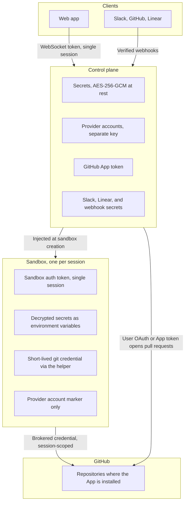

This page summarizes the trust boundaries and operator decisions for an OpenInspect deployment. [Authentication and Authorization](https://github.com/ColeMurray/background-agents/blob/main/docs/AUTH.md) is the canonical guide to security, resource access, and credential boundaries.

## One trusted organization

OpenInspect is designed for a single trusted organization. A deployment is one workspace. In GitHub-backed deployments, everyone admitted shares the same GitHub App installation.

- The App installation defines the workspace's maximum GitHub repository reach. Team-owned work also requires the owning team's repository grants, plus the acting user's feature permissions and resource access.
- OpenInspect does not compare a user's personal GitHub permissions with a repository before creating a session; team grants and OpenInspect permissions are separate from personal GitHub access.
- The trust boundary is the organization, not the individual user.

Teams add internal access boundaries, not tenant isolation. A new team has no repository grants; grants can name individual repositories or cover the installation. Repository secrets, skills, and images remain workspace resources, and some metadata/catalog operations still use installation-wide access. Do not treat Teams as separate App installations or isolation for mutually untrusted tenants. See [Teams](/administration/teams).

## Identity and admission

Sign-in is GitHub, Google, or both. After the provider verifies identity and email, the deployment's admission rules decide whether the person joins: by GitHub username, verified email, verified email domain, or active membership in an allowed GitHub organization. Admission is checked at sign-in only; suspension is the immediate revocation tool. Details are in [Workspace access and roles](/administration/workspace-access).

## Roles are product capabilities

The four roles (Owner, Administrator, Member, Viewer) decide which OpenInspect features a person can use: create sessions, manage settings, view the audit log, and so on. They are not repository ACLs. Team membership, repository grants, resource ownership, session visibility, and private collaborator grants add checks; role permissions alone do not grant access to every session, environment, or automation.

Being able to read a session does not grant sandbox or collaboration access. Prompting and sandbox access on team-owned sessions require current owning-team membership even for Owners and Administrators. Non-private team-session read isolation depends on [Teams enforcement](/administration/deployment#teams-enforcement), which defaults to `shadow`. For private-session exceptions and resource-specific rules, use the canonical [access rules](https://github.com/ColeMurray/background-agents/blob/main/docs/AUTH.md#teams-and-session-visibility); [Workspace access](/administration/workspace-access) explains the user-facing controls. See [Multiplayer and sharing](/sessions/multiplayer-and-sharing) for audience rules, defaults, and enforcement modes.

## Token architecture

| Token                         | Purpose                                             | Scope                                                                                         |
| ----------------------------- | --------------------------------------------------- | --------------------------------------------------------------------------------------------- |
| GitHub App installation token | Brokered git credentials for clone, fetch, and push | Persisted session repositories, intersected with current owning-team grants for team sessions |
| GitLab PAT                    | Deployment source-control credentials               | Deployment-wide PAT; not narrowed per session                                                 |
| User OAuth token              | Create pull requests as the user, identify the user | Repositories the user has access to                                                           |
| Sandbox auth token            | Authenticates sandbox-to-control-plane calls        | A single session                                                                              |
| WebSocket token               | Authenticates a client's live connection            | A single session                                                                              |
| Managed LLM token             | Short-lived OpenAI or xAI model access              | The provider account pinned to the session                                                    |

Where each credential lives, and what crosses each boundary:

Git credentials are brokered on demand, but the helper caches the response password on disk. Modal snapshots capture the full filesystem and can retain that cache, including files outside `/workspace`. Neither brokerage nor short-lived GitHub tokens guarantees credential-free snapshots. Treat snapshots as sensitive artifacts.

Grant removal changes subsequent credential resolution, not immediate revocation of issued tokens. GitLab's helper refresh time does not shorten the deployment PAT's lifetime. For dependency access, build-token scope, and user versus App identity, see the canonical [Repository and Credential Boundaries](https://github.com/ColeMurray/background-agents/blob/main/docs/AUTH.md#repository-and-credential-boundaries). Cache paths and runtime mechanics are in the [sandbox environment reference](/reference/sandbox-environment#git-credentials).

## Secrets and provider accounts

- Secrets live at global, team, repository, or environment scope. Repository-target sessions merge `global + owning team + repositories`; environment-target sessions merge `global + owning team + environment`. Later layers win, and the primary repository wins collisions between repositories. Workspace-owned sessions have no team layer. Environment-target sessions never inherit member-repository secrets. See [Secrets](/configure/secrets).
- Image builds have different inputs: repository-shared images use `global + repository`, never team secrets; environment images use `global + environment owning team + environment`, with no repository-secret inheritance. Workspace environments have no team layer. A team session using a workspace environment can therefore receive team secrets at runtime that were not present in that environment's image build.
- Values are encrypted with AES-256-GCM before storage, decrypted for session or image-build injection, and supplied as environment variables. Saved values are never returned to the browser or management API; only key names are visible.
- Team leads and workspace Administrators/Owners manage team secrets through human-only routes and the team's **Secrets** tab. Team-secret changes invalidate affected team-environment images and schedule best-effort rebuilds when prebuilds are enabled. Team secrets are not an additional legacy OAuth broker source.
- Variables set by the control plane always take precedence over user-defined secrets.
- OpenAI, xAI, and Claude subscription credentials are provider accounts, not generic secrets. They are encrypted with a separate key and never returned to the browser. In account mode, user-supplied provider secrets are removed from the sandbox environment; the sandbox receives a marker and requests credentials from the control plane. OpenAI and xAI access is short-lived, but a connected Claude account uses a setup token with a longer lifetime, fetched into the Claude harness at runtime. A deployment-wide `ANTHROPIC_API_KEY` may still be present in Modal or OpenComputer sandboxes even in account mode. See [Provider accounts](/models/provider-accounts).
- Administrative permissions control who can configure secrets and provider accounts; role-based read access never exposes their values.

## Sandbox boundaries

| Boundary             | What is inside                                                                                                                                                              | What to do                                                                                                                                                                              |
| -------------------- | --------------------------------------------------------------------------------------------------------------------------------------------------------------------------- | --------------------------------------------------------------------------------------------------------------------------------------------------------------------------------------- |
| Session sandbox      | Each session runs in its own isolated sandbox with a full development environment. It holds the session's auth token, the session's secrets, and whatever the agent writes. | Scope secrets so each session receives only what it needs.                                                                                                                              |
| Snapshots            | Modal captures the full filesystem, including the helper's on-disk SCM credential cache and files written by setup scripts or agent-run code.                               | Treat snapshots as sensitive; paths outside the workspace are not a snapshot-exclusion boundary.                                                                                        |
| Prebuilt images      | Whatever `setup.sh` writes during a build, using the build-specific secret layers above. A credential written to disk is served to every session that boots from the image. | Read secrets from the environment at runtime, and treat a scope's image as no less sensitive than its secrets. See [Secrets and images](/configure/prebuilt-images#secrets-and-images). |
| Claude Agent harness | The harness supplies the Claude credential to the agent process at runtime. Agent-run code and repository hooks can read it and could write it to disk.                     | Process-level delivery is not a credential-free snapshot guarantee. See [Agent harnesses](/models/agent-harnesses).                                                                     |

## Untrusted input in integrations

Content that arrives from outside the workspace is treated as data, not instructions:

- **GitHub.** Webhooks are verified and duplicate deliveries are deduplicated. Review prompts wrap the PR title, author, branches, and description as untrusted; comment-triggered prompts wrap the triggering comment. Review-thread file and diff context, and GitHub content the agent later reads itself, are not separately transformed. The bot ignores comments from its own configured login, not all bot-authored comments, and by default requires write, maintain, or admin repository access from the triggering user, or an explicit user allowlist.
- **Slack.** Requests are verified. Bot tokens stay server-side and never reach sandboxes. Slack identity linking is best-effort and is not used to approve repository access. Channel message triggers mean any member of a watched channel can start a run, and the message text reaches the agent; prefer a Slack user allowlist and small, trusted channels.
- **Linear.** Webhooks are verified; client credentials and runtime tokens stay server-side. Issue titles, descriptions, comments, and agent prompts are sent to the coding agent, so do not put secrets in them.
- **Inbound webhooks and PR feedback.** Automation webhook payloads and autofix feedback are wrapped as untrusted data before they reach the agent. See [Inbound webhooks](/automations/inbound-webhooks) and [GitHub](/integrations/github).

## Human approval remains authoritative

The built-in pull-request flow opens PRs but does not merge them. The sandbox's `gh` wrapper blocks `gh pr create` (and `gh pr new`), not `gh pr merge`: unless a user supplies their own token, the CLI uses a brokered GitHub App installation token, not the prompting user's OAuth permissions. An agent could merge through the CLI if the App's permissions and repository rules allow it. Merge outside the sandbox by default; enforce branch protection, required reviews, and CI in GitHub. When a pull request is opened as the prompting user, GitHub will not let that user approve their own work.

Attribution is not authorization. Commits carry the prompting user as author when their Git identity is available; otherwise they use the configured Git user or, with signing enabled, the signing account. Sessions record their creator and participants, but those labels record who asked for the work. Whether the work is accepted is decided by your review process, not by OpenInspect.

## Pre-production checklist

| Decision                            | What to do                                                                                                                                                                                                                                                |
| ----------------------------------- | --------------------------------------------------------------------------------------------------------------------------------------------------------------------------------------------------------------------------------------------------------- |
| Restrict admission                  | Configure at least one allowlist (GitHub usernames, email domains, exact emails, or GitHub organizations). Do not enable open access. Deploy behind your organization's SSO or VPN where possible.                                                        |
| Limit the App installation          | For GitHub deployments, install the App with **Select repositories**, not all repositories. This bounds workspace reach; session credentials are narrowed further.                                                                                        |
| Configure Teams deliberately        | Review team repository grants and default visibility, and choose `teams_enforcement` explicitly. The default `shadow` does not enforce all non-private Team-visibility reads.                                                                             |
| Least-privilege roles               | Keep most people as Members; grant Administrator only to people who manage settings, secrets, and members. Keep a second Owner so the last one is never stuck. [Analytics](/administration/analytics), including cost per user, is visible to every role. |
| Review integration trigger gates    | GitHub: repository scope and the trigger-user rule. Slack: channel invitations, user allowlists on channel triggers. Linear: repository scope.                                                                                                            |
| Choose secret scopes deliberately   | Use global scope only for workspace-wide values, team scope for owning-team session values, and repository or environment scope for target-specific values. Review the separate build formulas and keep long-lived secrets out of `setup.sh` writes.      |
| Keep branch protection              | Required reviews and CI are your merge gate. The sandbox CLI does not block merge commands, so enforce the gate in GitHub.                                                                                                                                |
| Decide on sandbox tools and autofix | Sandbox terminal, code server, VNC, and tunnel ports are configurable per scope ([Sandbox settings](/configure/sandbox-settings)). PR Feedback Autofix is off by default; if you enable it, set the review-bot allowlist and attempt limit.               |
| Review provider retention           | Sandboxes, snapshots, and prebuilt images live with your sandbox provider. Check its retention and your timeout settings, and remember images carry whatever setup wrote to disk.                                                                         |

## Next steps

- [Workspace access and roles](/administration/workspace-access)
- [Audit log](/administration/audit-log)
- [Deployment overview](/administration/deployment)
