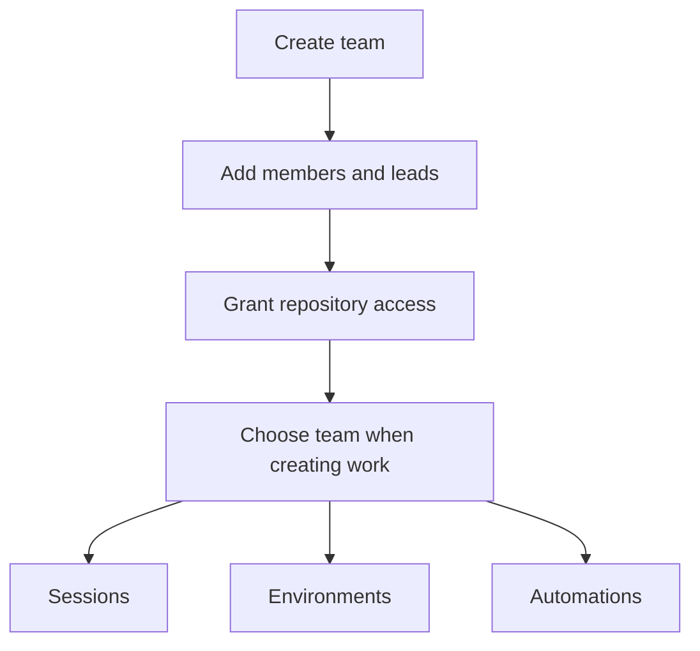

Teams organize members and own sessions, environments, and automations inside one workspace. They also hold repository grants and secrets. Team membership does not replace your [workspace role](/administration/workspace-access): both resource access and the relevant feature permissions apply.

<Callout type="warn" title="Check session enforcement before relying on Team visibility">
  The default deployment mode is `shadow`. Non-private team-session read isolation is enforced only
  when `TEAMS_ENFORCEMENT` is `on`. Private-session access and team-owned non-read actions are
  enforced in every mode. Repository grants and team resource authorization are not disabled by this
  flag. See [Teams enforcement](/administration/deployment#teams-enforcement).
</Callout>

## Set up a team

Creating a team requires `workspace.members.manage`, held by workspace Owners and Administrators in the built-in roles.

1. Open **Settings > Teams** and select **Create team**.
2. Enter a name and slug, then select **Create**. You become the first team lead.
3. Open the team's details. Set its description, **Join policy**, and **Default visibility**, then select **Save changes**.
4. Add members and grant repository access before starting repository-backed team work.

A team's **Default visibility** can be **Team** or **Workspace**, never Private. Users can still explicitly choose **Private** for an individual session, including a team-owned one, subject to membership and access checks.

A new team has no repository grants. Creating a team does not give it access to every installed repository.

## Join and manage membership

Open **Teams** to browse **My teams** or **All teams**, search by name, slug, or description, and favorite teams for quick access. The directory's **All teams** lists discoverable teams; it does not grant access to their work.

- **Open:** an active team offers **Join team** to non-members.
- **Invite only:** a team lead or workspace Owner/Administrator adds you. There is no self-join path.
- **Member:** can access eligible team work, subject to workspace permissions.
- **Lead:** can manage team details, members, repository grants, and team secrets. Environment and automation management still require their corresponding feature permissions.

Use the team's **Members** tab or its Settings detail to add a member, change **Member** to **Lead**, or remove someone. With workspace member-directory permission, the add control offers a picker; otherwise, a lead enters a known workspace user ID. Directory browsing does not expose everyone else's email address to ordinary members.

To leave, select **Remove** on your own membership row in the team's **Members** tab or Settings detail. The last lead cannot leave, be removed, or be demoted; promote another lead first. Losing membership also removes eligibility for team-owned session actions and for private collaborator access on that team's sessions.

Workspace Owners and Administrators can administer teams without joining, but must actually belong to a team to create or act on its sessions or execute its automations. Administrative read access is not permission to prompt or use a sandbox.

## Grant repository access

Team leads and workspace Owners/Administrators manage the **Repositories** tab. Members can inspect the grants.

1. Open the team's **Repositories** tab.
2. Under **Add repository grant**, choose **Named repositories** or **All installation repositories**.
3. For named grants, select an installed repository and add it. Repeat for every repository the team's sessions or environments need.
4. To switch grant scope, remove the existing grants first. Named and installation-wide grants cannot coexist on one team.

An installation-wide grant covers current and future repositories accessible to the installation. It does not give a sandbox a token for every repository: GitHub credentials are limited to the session's own repositories, intersected with current team grants. Private dependencies and submodules need to be included in the session's repository set. See [Security and trust model](/administration/security#token-architecture).

Repository-backed team creation requires grants covering every selected repository, including every repository in an environment. Repository-less sessions do not need grants. Removing a grant can block new work and later automation runs; it does not remove stored repository references or immediately revoke an already-issued GitHub credential.

Repository secrets, skills, and images remain workspace resources. Once a repository has team grants, their workspace access checks also account for current membership in an active granting team, with lead authority required for repository secrets and workspace administrative exceptions. A grant is not ownership of those shared resources.

## Find team work

The team page exposes tabs according to your access:

| Tab          | Purpose                                                                  |
| ------------ | ------------------------------------------------------------------------ |
| Overview     | Discover the team's sessions.                                            |
| Members      | Inspect membership; leads and workspace administrators can manage it.    |
| Repositories | Inspect or manage repository grants.                                     |
| Environments | Find and manage team-owned environments.                                 |
| Automations  | Find team-owned automations when your role permits automation reads.     |
| Secrets      | Manage team secrets; shown to leads and workspace administrators.        |
| Channels     | Leads and workspace administrators bind Slack channels and Linear teams. |
| Settings     | Edit team details and defaults, or archive the team.                     |

The sidebar scope switcher changes which work you browse. **Workspace** means workspace-owned work, not all work with Workspace visibility. Selecting a team does not change the ownership of an existing resource. See [Inbox and search](/sessions/inbox-and-search) for the aggregate scopes and session filters.

## Create team-owned work

Choose a team when creating a session, environment, or automation. Ownership cannot later move between teams or between a team and the workspace.

Automation creation requires both `automations.create` and `sessions.create`. Team child-session
creation requires the active prompt author's current membership; the agent cannot fall back to the
parent owner's membership if that author is unresolved or has left.

| Resource    | Team behavior                                                                                                                                                                                                                                        |
| ----------- | ---------------------------------------------------------------------------------------------------------------------------------------------------------------------------------------------------------------------------------------------------- |
| Session     | Creator must be a current member of the active team. Without an explicit visibility choice, the session uses the team's default.                                                                                                                     |
| Environment | Creation and management require an owning-team lead or workspace administrator plus `environments.manage`. Names are unique within the team or workspace ownership scope. A team environment can launch only into a session owned by that same team. |
| Automation  | The executor must qualify to launch work and belong to the active owning team. Scheduled/event runs use the executor; manual runs use the requester. Runs recheck membership and grants, and sessions use the team's current default visibility.     |

Eligible workspace environments can also appear in a team's session catalog. Environments belonging to other teams cannot be used there. An automation's owning team is separate from its executor; authorized leads and administrators can reassign the executor through the API without moving the automation.

See [Environments](/configure/environments) and [Automations](/automations) for resource-specific permissions and execution rules.

### Ownership and visibility

Session visibility controls reading, not ownership:

- **Workspace:** readable across the workspace by users with session read permission.
- **Team:** team members and workspace Owners/Administrators can read when enforcement is `on`; the enforcement warning above applies in other modes.
- **Private:** the session owner and explicit collaborators can read, with an audited break-glass read path for workspace Owners. A team-owned session's collaborators must retain membership.

Making a team session Workspace-visible does not allow non-members to prompt, manage, or use its sandbox. Changing the team's default does not rewrite existing session visibility. Sharing and child-session visibility controls are described in [Multiplayer and sharing](/sessions/multiplayer-and-sharing).

### Require a team on creation

Workspace Owners and Administrators can enable **Settings > Teams > Require a team for new sessions**. Despite the label, this policy also applies to new environment and automation definitions. Requests without a team fail with `team_required`.

The policy does not move or hide existing workspace resources, and existing workspace automations can still run when their runtime authorization passes. Bot creation paths that do not supply a team can be refused; enabling this setting does not add team selection to every integration.

## Team secrets

Leads and workspace Owners/Administrators manage the **Secrets** tab. Saved values are not returned; only key names are listed. Team-owned sessions receive global secrets, then owning-team secrets, then target environment or repository secrets, with later layers winning collisions.

Team-owned environment image builds include the team's secrets. Repository-shared image builds never include team secrets. Team-secret changes invalidate affected environment images and schedule best-effort rebuilds when prebuilds are enabled. See [Secrets](/configure/secrets) and [Prebuilt images](/configure/prebuilt-images#secrets-and-images).

## Route integrations to the team

Leads and workspace Owners/Administrators use the **Channels** tab to bind a Slack channel or an external Linear team ID. Choose **Primary** for the team's main binding for that provider or **Source** for another inbound source. Both kinds route new sessions to this team; neither selects a default notification destination. One external channel/team can belong to only one OpenInspect team, and a team can have only one primary binding per provider.

For Slack, invite the bot first: the binding refuses channels it has not joined and externally shared channels. For Linear, enter the external team ID, not an issue-key prefix. Existing Linear repository/environment mappings choose a target but do not establish team ownership; create the binding explicitly. Neither binding type grants membership or moves existing sessions.

In **Settings > Integrations**, Slack has an **Unbound channels** policy and Linear has **Unbound Linear teams**. Each stores its own `unboundChannels` setting: `workspace` (default) creates workspace-owned sessions for unbound sources; `reject` refuses creation until a binding exists. Workspace fallback still fails when **Require a team for new sessions** is enabled. Configure each provider separately and ensure the acting users have team membership and repository grants.

GitHub has no channel binding. Mentions route from the linked PR session, then the sender's eligible team, with workspace fallback when unresolved; event automations use their own team and executor. Deprecated auto-review-on-open remains workspace-owned. See [Slack](/integrations/slack), [Linear](/integrations/linear), and [GitHub](/integrations/github) for routing, output restrictions, and troubleshooting.

## Archive and restore

A lead or workspace Owner/Administrator can select **Archive team** in the team settings. Archived teams disappear from the active directory and cannot be selected for new team work. Their automations fail the active-team runtime check. Archiving does not transfer resources to the workspace or erase session history.

Use **Settings > Teams** to open an archived team's details and select **Restore team**. Restoring does not replace missing repository grants or an executor's lost membership or permissions.

## Troubleshooting

| Symptom                                                  | What to check                                                                                                                                                                                          |
| -------------------------------------------------------- | ------------------------------------------------------------------------------------------------------------------------------------------------------------------------------------------------------ |
| A newly created team has no usable repositories          | Add grants in **Repositories**; installation access alone is insufficient.                                                                                                                             |
| `target_team_missing_grant`                              | Check grants for every target repository, including environment members.                                                                                                                               |
| `team_required`                                          | Select a team; the workspace requires team ownership for new resources.                                                                                                                                |
| `environment_team_mismatch`                              | A team session can use its team's environment or an eligible workspace environment. An automation's environment must have exactly the same ownership as the automation, including workspace ownership. |
| An administrator can read a session but cannot prompt it | Join its owning team and check action permissions; private access has additional collaborator rules.                                                                                                   |
| A team automation stops running                          | Check archive state, executor membership and permissions, and current repository grants.                                                                                                               |
| A resource returns not found                             | It may be hidden by access rules, not deleted. Ask a lead or workspace administrator to check ownership and membership.                                                                                |
| Team-visible sessions are readable outside the team      | Have the operator check `TEAMS_ENFORCEMENT`; the default is `shadow`.                                                                                                                                  |

## Next steps

- [Workspace access and roles](/administration/workspace-access)
- [Multiplayer and sharing](/sessions/multiplayer-and-sharing)
- [Audit log](/administration/audit-log)
- [Teams enforcement](/administration/deployment#teams-enforcement)
