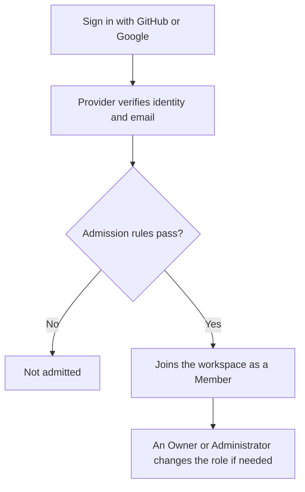

This page explains who can get into your workspace, what each role permits, and how to change or suspend a member from Settings › Workspace access.

<Callout type="info" title="One workspace, one trusted organization">
  An OpenInspect deployment is a single workspace. The source-control App installation defines which
  repositories the workspace can reach. Roles control which OpenInspect features a person can use;
  they are not per-repository access lists. Team membership, repository grants, resource ownership,
  and session visibility add resource-specific checks. See [Teams](/administration/teams) and
  [Security and trust model](/administration/security).
</Callout>

## Signing in and admission

A deployment can offer GitHub sign-in, Google sign-in, or both. The sign-in page shows only the providers the operator configured.

Signing in has two stages:

1. Your identity provider verifies your identity and email address.
2. The deployment's admission rules decide whether you may join the workspace.

Admission can be limited by any of the following, depending on how the deployment is configured:

| Allowlist kind              | What it matches                       |
| --------------------------- | ------------------------------------- |
| GitHub username             | The signed-in GitHub login            |
| Verified email address      | An exact address                      |
| Verified email domain       | Any address on the domain             |
| Allowed GitHub organization | Active membership in the organization |

These rules are checked at sign-in. Removing someone from an allowlist or from a GitHub organization does not end an existing browser session. When access must be revoked immediately, suspend the member (see [Suspension](#suspension)).

Signing in does not make anyone an Owner or Administrator. Every admitted user has exactly one workspace role, and new users receive the Member role by default.

## Roles

OpenInspect has four built-in roles. This table describes workspace feature permissions, not unconditional access to every resource. The session, automation, and environment rules below also apply.

| Capability                                              | Owner | Administrator | Member | Viewer |
| ------------------------------------------------------- | :---: | :-----------: | :----: | :----: |
| View repositories and environments                      |  Yes  |      Yes      |  Yes   |  Yes   |
| Use repositories and environments in sessions           |  Yes  |      Yes      |  Yes   |   No   |
| Manage shared settings, integrations, and secrets       |  Yes  |      Yes      |   No   |   No   |
| Create sessions                                         |  Yes  |      Yes      |  Yes   |   No   |
| Read sessions permitted by visibility rules             |  Yes  |      Yes      |  Yes   |  Yes   |
| Collaborate in and manage permitted sessions            |  Yes  |      Yes      |  Yes   |   No   |
| View automations                                        |  Yes  |      Yes      |  Yes   |  Yes   |
| Create automations                                      |  Yes  |      Yes      |  Yes   |   No   |
| Manage and trigger automations as executor or team lead |  Yes  |      Yes      |  Yes   |   No   |
| Manage and trigger any automation                       |  Yes  |      Yes      |   No   |   No   |
| View and manage workspace members                       |  Yes  |      Yes      |   No   |   No   |
| View the audit log                                      |  Yes  |      Yes      |   No   |   No   |
| Transfer workspace ownership                            |  Yes  |      No       |   No   |   No   |
| View analytics                                          |  Yes  |      Yes      |  Yes   |  Yes   |
| View provider accounts                                  |  Yes  |      Yes      |  Yes   |   No   |
| View image-build history                                |  Yes  |      Yes      |  Yes   |  Yes   |
| Manage personal skill profiles                          |  Yes  |      Yes      |  Yes   |   No   |

**Owner.** All workspace feature permissions, subject to resource-specific checks. Owners have audited break-glass read access to private sessions by session ID, but do not automatically gain collaboration or sandbox access. Only Owners can grant or remove the Owner role or suspend and restore another Owner. The final active Owner cannot be suspended or demoted, so the workspace cannot lose all ownership by accident.

**Administrator.** Runs the workspace day to day: members, permitted sessions, automations, repositories, environments, provider accounts, integrations, secrets, and the audit log. Administrators need session ownership or an explicit collaborator grant to access a private session. They cannot transfer ownership, change who holds the Owner role, or suspend and restore an Owner.

**Member.** Creates and uses eligible sessions, repositories, environments, and automations. Members manage and manually trigger automations for which they are the executor or an owning-team lead. Team leads also have team-specific administration capabilities; that does not grant workspace-wide configuration access. Members can view [analytics](/administration/analytics).

**Viewer.** Read access to eligible sessions, automations, repositories, and environments, plus shared analytics, skills, and MCP servers. The workspace role does not permit session creation or prompting, sandbox access, personal skill-profile management, automation triggering, or shared configuration changes. Team-lead capabilities are separate from the workspace role.

## How session access works

Session ownership and visibility are separate. Ownership is fixed at creation; a team-owned session remains team-owned even when its visibility is **Workspace**.

- **Workspace** visibility allows workspace users with session read permission to read the session.
- **Team** visibility limits reads to owning-team members and workspace Administrators/Owners when Teams enforcement is `on`. Non-private read isolation is not fully enforced in `off` or the default `shadow` mode; see [Teams enforcement](/administration/deployment#teams-enforcement).
- **Private** visibility permits the session owner and explicit collaborators. A collaborator on a team-owned session must still belong to that team. Private access is enforced in every mode.
- Except for collaborator self-removal, every non-read action on a team-owned session requires current owning-team membership, including for Administrators and Owners. Feature permissions and action-specific checks still apply; being able to read does not grant collaboration, lifecycle, deletion, or sandbox access.
- A workspace Owner, but not an Administrator, can read another person's private session through audited break-glass access. That read does not make the Owner a collaborator or grant sandbox access, and it does not bypass membership requirements for team-owned session actions.

The recorded session owner matters for private access and sharing controls. Participant labels grant nothing. The **Mine** filter and team discovery scope help find sessions; neither is a substitute for authorization. See [Multiplayer and sharing](/sessions/multiplayer-and-sharing) for defaults, private collaborators, and sharing controls.

Creating a session also requires permission to use the selected repository or environment. A role can therefore view an existing session without being allowed to create a new one.

New HTTP requests reflect role changes and suspension immediately. Live browser connections to a session are rechecked at least every five minutes, so an open connection can remain for up to five minutes after access changes. Nobody needs to recreate the session.

## How automation access works

Workspace-owned automation definitions are readable with automation read permission. Team-owned definitions require that permission plus owning-team membership or workspace Administrator/Owner status. Run history does not grant access to linked sessions: unreadable session IDs, titles, and artifact summaries are redacted.

The owning team and executor are different identities. The executor is the canonical workspace user whose authority is used for scheduled and event-driven runs, initially the creator. With the relevant feature permission, the executor or an owning-team lead can manage and trigger an eligible automation; Administrators and Owners have workspace-wide management and trigger permissions. Manual execution still requires the requester to qualify for the resulting session.

Creating an automation also requires `sessions.create` because the creator is its initial executor. Later scheduled and event-driven runs use the configured executor, which can be reassigned.

| Run type                   | Runs under whose authority                                                                                                                                                                                                                                      |
| -------------------------- | --------------------------------------------------------------------------------------------------------------------------------------------------------------------------------------------------------------------------------------------------------------- |
| Scheduled and event-driven | The configured executor. At run time the executor must be active, allowed to create sessions and use the selected targets, and, for team automations, a current member of the active owning team. Target repository grants are rechecked.                       |
| Manual (**Trigger Now**)   | The person who clicked **Trigger Now**, even when an Administrator or Owner triggers someone else's automation. The requester must be allowed to trigger it and to create the resulting session; their identity and linked source-control credentials are used. |

Generated sessions inherit the automation's owning team and that team's current default visibility. A team lead or workspace Administrator/Owner with automation management access can reassign the executor through `PATCH /automations/:id` with `{ "userId": "<canonical-user-id>" }`. The replacement must qualify to execute the automation. Being the current executor alone does not authorize reassignment. See [Automations](/automations#who-can-create-and-manage-automations).

## How environment access works

Workspace environments use workspace feature permissions. Team environments additionally require owning-team membership or workspace Administrator/Owner status to read or use; managing them requires `environments.manage` plus owning-team lead or workspace Administrator/Owner status. A team environment can launch only into a session owned by the same team. Eligible workspace environments can also appear in a team's session catalog.

Environment secret writes/imports/deletes, settings changes, and image-build actions require environment management access **as well as** their respective feature permission (`environments.secrets.manage`, `environments.settings.manage`, or `environments.images.manage`). This includes workspace environments: a custom role with only a feature permission is insufficient. Secret-key listing instead requires the secrets permission and environment read access; it never returns values.

The workspace's require-team-on-create policy applies to new sessions, environment definitions, and automation definitions. It does not by itself prohibit runs of existing workspace-owned automations. See [Teams](/administration/teams).

## Bots and integrations

The Slack, GitHub, and Linear integrations act on behalf of a workspace user when they handle that user's request. Their effective access is limited by both the acting user's current role and the integration's fixed set of allowed operations. An integration cannot bypass a suspended user or perform workspace administration just because the acting user is an Owner. Calls that do not identify an acting user are denied unless a specific integration route explicitly permits that operation.

Integrations also apply their own ingress rules. The GitHub integration, for example, can require an allowed trigger user or sufficient repository collaborator access before it sends a request to OpenInspect. See [Integrations](/integrations).

## Suspension

There is no action to remove a member from the workspace; suspension is the way to take someone's access away. Suspending a member disables their access without deleting their account or historical attribution. After suspension:

- New browser and bot operations are denied.
- Existing browser sign-in sessions are invalidated.
- Live browser session connections close within five minutes.
- Scheduled and event-driven automations using the member as executor no longer pass run authorization.
- Existing session history and authorship remain intact.

Suspension does not stop a sandbox that is already executing. A user with the required session action access can stop or archive it separately; Administrators and Owners still need membership for team-owned session actions.

## Managing members

Owners and Administrators manage members from Settings › Workspace access. The page lists each member with their display name, email, assigned role, and a **Suspend** or **Restore** button, followed by a Roles section showing each role, its description, and how many members hold it.

<Steps>
<Step>
### Review members and roles

Open Settings › Workspace access. Each row shows the member's current role. The Roles section below lists the built-in roles with their assignment counts.

</Step>
<Step>
### Change a member's role

Choose a new role from the drop-down on the member's row. The change is applied immediately and recorded in the [audit log](/administration/audit-log). Only an Owner sees the Owner option, and only an Owner can change another Owner's role.

</Step>
<Step>
### Suspend or restore a member

Click **Suspend** to disable access, or **Restore** to reinstate a suspended member. The button is disabled for an Owner when you are not an Owner yourself, and for the last active Owner.

</Step>
</Steps>

Rules that apply regardless of who is signed in:

- Only an Owner can assign or remove the Owner role or suspend and restore another Owner.
- The last active Owner cannot be suspended or demoted. Promote a second Owner first.

### Initial Owner bootstrap

The first person to sign in receives the Member role and is not promoted automatically. On a new deployment, the intended Owner signs in once, and a deployment operator runs the Owner bootstrap command with that person's user ID. This is an operator step; see the [self-hosting guide](https://github.com/ColeMurray/background-agents/blob/main/docs/GETTING_STARTED.md) and [Deployment overview](/administration/deployment).

## Troubleshooting

<Accordions>
  <Accordion title="A removed person can still use the workspace">
    Allowlists and GitHub organization membership are checked only at sign-in, so an existing
    browser session continues. Suspend the member from Settings › Workspace access to cut access
    now.

</Accordion>
  <Accordion title="The role drop-down or Suspend button is disabled for a member">
    The member is an Owner and you are an Administrator, or the member is the last active Owner. Ask
    an Owner to make the change, or promote another Owner first.

</Accordion>
  <Accordion title="A scheduled automation stopped running after a role change">
    Scheduled and event-driven runs execute under the configured executor's authority. Suspension,
    lost permissions or team membership, an archived team, or removed repository grants can prevent
    execution. Restore the required access, or have an authorized team lead or workspace
    Administrator/Owner reassign the executor through the API. Recreating the automation is not required.

</Accordion>
</Accordions>

## Next steps

- [Teams](/administration/teams)
- [Audit log](/administration/audit-log)
- [Security and trust model](/administration/security)
- [Multiplayer and sharing](/sessions/multiplayer-and-sharing)
