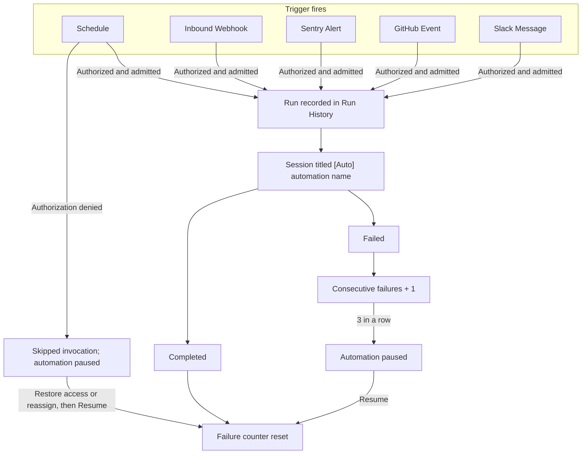

An automation stores a repository selection, a model, and a set of instructions once, then starts a new session every time its trigger fires.


## What an automation does

An authorized, admitted firing starts an ordinary session. The session clones the configured repository, runs your instructions on the OpenCode or Claude Agent harness you chose, and can open a pull request like any other session. Sessions started by an automation are titled `[Auto] <automation name>` and appear in the sessions list alongside interactive sessions.

Authorized firings follow the path below. Repeated failures pause the automation; scheduled execution authorization denial pauses it immediately instead:



Open **Automations** in the sidebar to see the automations available to you in the selected scope, or click **Browse templates** to start from a pre-built idea. Team-owned automations also appear on their team's **Automations** tab.

## Trigger types

| Trigger         | Fires when                                                                    | Availability                                    |
| --------------- | ----------------------------------------------------------------------------- | ----------------------------------------------- |
| Schedule        | A cron schedule comes due                                                     | Available                                       |
| Inbound Webhook | Any system sends an authenticated HTTP `POST`                                 | Available                                       |
| Sentry Alert    | A Sentry Custom Integration delivers a new error, regression, or metric alert | Available                                       |
| Slack Message   | Someone posts a matching message in a watched Slack channel                   | Available                                       |
| GitHub Event    | A pull request, issue, comment, check suite, or workflow run event arrives    | Available when the GitHub bot is deployed       |
| Linear Event    | Linear issue activity                                                         | Planned (shown as "Soon" in the trigger picker) |

The trigger type is fixed after creation. To change it, create a new automation.

## Common use cases

- Nightly or weekly dependency updates that open a pull request.
- Reacting to a deploy or incident webhook from your own tooling.
- Triaging new [Sentry issues](/automations/sentry-alerts) and opening a fix PR.
- Reviewing pull requests as they open.
- Recurring reports posted back to Slack.

<Cards>
  <Card
    title="Create your first automation"
    href="/automations/first-automation"
    description="A step-by-step tutorial for a weekly scheduled automation."
  />
  <Card
    title="Schedules"
    href="/automations/schedules"
    description="Presets, custom cron expressions, timezones, and Trigger Now."
  />
  <Card
    title="Inbound webhooks"
    href="/automations/inbound-webhooks"
    description="Trigger from any system with a JSON POST and JSONPath filters."
  />
  <Card
    title="GitHub event triggers"
    href="/automations/github-events"
    description="Pull request, issue, comment, and CI events with conditions."
  />
  <Card
    title="Slack message triggers"
    href="/automations/slack-messages"
    description="Watch channels and reply in-thread."
  />
  <Card
    title="Sentry alerts"
    href="/automations/sentry-alerts"
    description="New errors, regressions, and metric alerts."
  />
  <Card
    title="Multi-repository automations"
    href="/automations/multi-repository"
    description="Fan one scheduled firing out across up to 10 repositories."
  />
  <Card
    title="Automation templates"
    href="/automations/templates"
    description="Pre-filled starting points in the Templates gallery."
  />
</Cards>

## Who can create and manage automations

Automations can be workspace-owned or team-owned. Ownership is separate from the **executor**, the canonical workspace user whose authority is used for scheduled and event-driven runs. The creator is initially the executor; changing the executor does not change the owning team.

| Operation                   | Access required                                                                                                                                                                                                             |
| --------------------------- | --------------------------------------------------------------------------------------------------------------------------------------------------------------------------------------------------------------------------- |
| Read a workspace automation | Automation read permission, including the built-in Viewer role.                                                                                                                                                             |
| Read a team automation      | Automation read permission plus either current owning-team membership or workspace Administrator/Owner status.                                                                                                              |
| Create                      | Both `automations.create` and `sessions.create`, plus valid target access. A team executor must belong to the active owning team. The workspace's require-team-on-create policy also applies to new automation definitions. |
| Manage or manually trigger  | The corresponding feature permission. Members can act as the executor or owning-team lead on an eligible automation; Administrators and Owners have workspace-wide management and trigger permissions.                      |
| Reassign executor           | Automation management access plus owning-team lead or workspace Administrator/Owner authority. Executor status alone is insufficient.                                                                                       |

Scheduled and event-driven runs use the configured executor. **Trigger Now** uses the requester, including their identity and linked source-control credentials. At run time, that execution user must still be active and allowed to create sessions and use the targets. For team automations, they must also remain a member of the active owning team, even if they are an Administrator or Owner. Repository grants and environment ownership/access are rechecked for the selected targets before launch.

Generated sessions inherit the automation's owning team and the team's current default visibility; workspace-owned automations produce Workspace-visible sessions. Requiring a team for new definitions does not itself disable existing workspace-owned automation runs.

### Reassigning an executor

An authorized team lead or workspace Administrator/Owner can use the control-plane API rather than recreate the automation:

```http
PATCH /automations/<automation-id>
Content-Type: application/json

{ "userId": "<canonical-user-id>" }
```

The request must authenticate as an authorized human user. The replacement must be active and able to execute the stored targets; for a team automation they must belong to the active owning team. A successful change records `automation.executor_changed` in the [audit log](/administration/audit-log). This is an API operation, not a documented UI reassignment control.

Reading an automation or its run history does not automatically grant access to generated sessions. When a session is not readable, its ID, title, and artifact summary are redacted from run history. Owner break-glass does not enumerate private session details in run lists; an individual run read can apply audited break-glass. See [Workspace access](/administration/workspace-access#how-automation-access-works) and [Teams](/administration/teams).

## Automation statuses

The badge on each automation shows one of three states:

| Status   | Meaning                                                                                                                 |
| -------- | ----------------------------------------------------------------------------------------------------------------------- |
| Enabled  | Ready to fire on its trigger.                                                                                           |
| Degraded | Enabled but has recent consecutive failures. The badge shows the count, for example "Degraded (2 failures)".            |
| Paused   | Not firing. Paused by a person, after repeated failures, or immediately after scheduled execution authorization denial. |

## Run statuses

Each recorded invocation appears as one row in the automation's **Run History**. Generic event execution-authorization denials are not recorded there. GitHub repository-grant denials are an exception: matching events can produce a sessionless **Unauthorized** invocation with reason `repo_not_granted` before executor authorization, including when the executor cannot be resolved. A missing executor alone does not create that record.

| Status          | Meaning                                                                                                             |
| --------------- | ------------------------------------------------------------------------------------------------------------------- |
| Starting        | A session is being created for this run.                                                                            |
| Running         | At least one session is executing.                                                                                  |
| Completed       | Every session finished successfully.                                                                                |
| Failed          | Every session failed. The failure reason is shown on the row.                                                       |
| Partial failure | A multi-repository firing where some repositories completed and some failed.                                        |
| Skipped         | A previous run was still active, or a scheduled firing was denied execution authorization.                          |
| Unauthorized    | GitHub event admission found no owning-team grant for the repository (`repo_not_granted`); no session was launched. |

When the linked session is readable, click **View session** on a row to open its output and artifacts. Rows with redacted session details do not grant access to the session.

## Concurrency

Scheduled and manual triggers allow one active run per automation: a schedule slot that comes due during an active run is recorded as **Skipped**, and **Trigger Now** is rejected. Event-driven triggers use per-event concurrency keys, so unrelated events (for example two different pull requests) can run at the same time. The scheduled rules are in [Schedules](/automations/schedules#one-active-run-at-a-time); event rules are on each trigger's page.

## Auto-pause after failures

Scheduled execution authorization denial is separate from the failure threshold: it records a **Skipped** invocation, pauses the automation immediately, and clears the next run time without adding a failure strike. Restore the required executor/team/target access or [reassign the executor](#reassigning-an-executor), then click **Resume**. Restoring access or reassigning alone does not resume the schedule. Generic event execution-authorization denial increments the event response's `skipped` count without pausing the automation or recording a run-history invocation. GitHub's pre-admission repository-grant denial instead records **Unauthorized** as described above; it also counts as skipped in the event response and neither adds a failure strike nor resets existing failures.

An automation that fails three consecutive times is paused automatically. Scheduled and manual runs both count. Runs that outlive their execution budget count as failures too. Skipped firings count neither way.

Click **Resume** to re-enable the automation. Resuming resets the failure counter and, for schedules, computes the next run from the current moment. A successful **Trigger Now** while paused also resets the counter without resuming.

## Execution timeout

Each run's session has an execution budget: the sandbox timeout in effect for the run's repository or environment (see [Sandbox settings](/configure/sandbox-settings)), otherwise the operator's `EXECUTION_TIMEOUT_MS`, otherwise 2 hours. The session fails the prompt at the budget, and the run fails with it. If that completion never reaches the scheduler, a sweep fails the run with reason `execution_timeout` after an additional grace period of 100 minutes. A run that reports success after the sweep already declared it lost is corrected back to Completed, but the failure strike already counted stays until the next fully successful firing.

## Limits

| Limit                                        | Value                                                                                                         |
| -------------------------------------------- | ------------------------------------------------------------------------------------------------------------- |
| Automation name                              | 200 characters                                                                                                |
| Instructions                                 | 15,000 characters                                                                                             |
| Repositories and environments per automation | 10 combined (schedule triggers only; event triggers take 0 or 1 repository)                                   |
| Minimum schedule interval                    | 15 minutes                                                                                                    |
| Inbound webhook payload                      | 64 KB                                                                                                         |
| Sentry webhook payload                       | 256 KB                                                                                                        |
| Concurrent runs per automation               | 1 for scheduled and manual triggers                                                                           |
| Consecutive failures before auto-pause       | 3                                                                                                             |
| Run execution timeout                        | The session's execution budget (2 hours by default), plus a 100-minute sweep grace before `execution_timeout` |

## Next steps

- [Create your first automation](/automations/first-automation)
- [Automation templates](/automations/templates)
- [Reference: statuses](/reference/statuses)
