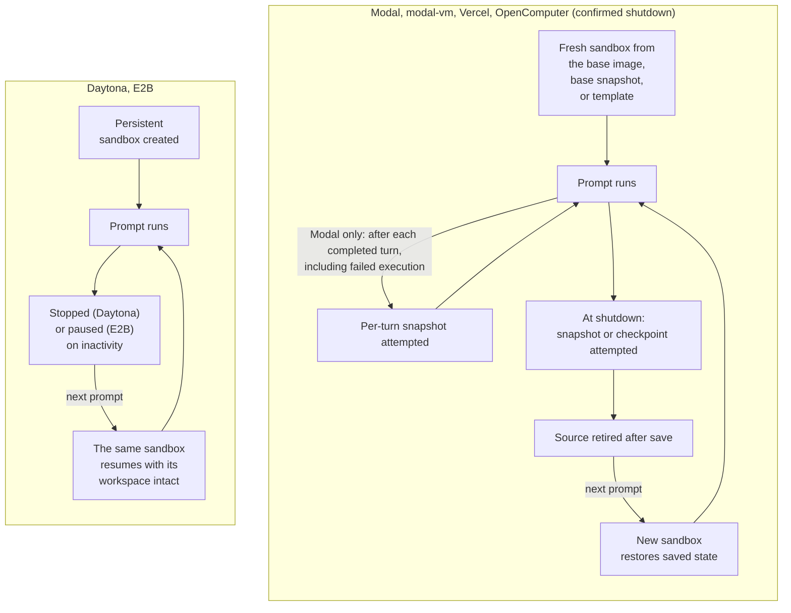

This page compares the sandbox providers a deployment can run on: the operator picks one (`sandbox_provider` in the deployment configuration) for every session, and each runs the same [sandbox runtime](/reference/sandbox-environment) but differs in how sandboxes start, how saved state is kept, and which [sandbox settings](/configure/sandbox-settings) it honors.

## Which provider am I on?

Users cannot switch providers from the app. Settings › Sandbox names the provider when it cannot honor a field, for example "Per-session CPU and memory overrides are unavailable for daytona; resources are configured by the deployment." A timeout-only note ("Per-session timeout overrides are unavailable for ...") appears on Daytona as well. No note means Modal, modal-vm, or Vercel Sandboxes; ask your operator which one.

## Comparison

|                          | Modal                                     | modal-vm                                      | Daytona                                                                          | Vercel Sandboxes                                              | OpenComputer                                                                        | E2B                                                                                   |
| ------------------------ | ----------------------------------------- | --------------------------------------------- | -------------------------------------------------------------------------------- | ------------------------------------------------------------- | ----------------------------------------------------------------------------------- | ------------------------------------------------------------------------------------- |
| Startup model            | Fresh sandbox from the base runtime image | Fresh Docker-capable Modal VM sandbox         | Persistent sandbox created from a base snapshot                                  | Fresh sandbox from a base-runtime snapshot                    | Persistent sandbox created from a managed template                                  | Fresh sandbox from a managed template                                                 |
| Saved-state model        | Filesystem snapshot restore               | Filesystem snapshot at shutdown, then restore | Persistent sandbox: stopped on inactivity or stale heartbeat, then started again | Filesystem snapshot at shutdown, then restore                 | Confirmed shutdown checkpoints and restores; retained-object wake is also supported | Persistent sandbox: paused on inactivity, resumed on the next prompt                  |
| Prebuilt images          | Yes (Modal image)                         | Yes (Modal VM image)                          | Yes, once the operator opens admission (snapshot)                                | Yes (snapshot)                                                | Yes (checkpoint)                                                                    | Yes (snapshot)                                                                        |
| CPU and memory settings  | Yes                                       | Yes                                           | No                                                                               | Yes, mapped to vCPUs                                          | No                                                                                  | No                                                                                    |
| Sandbox timeout setting  | Yes                                       | Yes                                           | No                                                                               | Yes                                                           | Yes                                                                                 | Yes                                                                                   |
| Default sandbox lifetime | 2 hours; configurable                     | 2 hours; configurable                         | Persistent sandbox; the timeout setting is not honored                           | 45-minute sandbox lifetime; image builds capped at 35 minutes | OpenComputer's own default; configurable                                            | Operator-set TTL (default 2 hours; about 1 hour on the Hobby tier); auto-pause at TTL |

"Yes" for CPU and memory means the `cpuCores` and `memoryMib` fields under Settings › Sandbox take effect. On providers marked "No", those fields are dropped from the session's effective settings. The same applies to `sandboxTimeoutMs` where the timeout column says "No". The settings page hides the fields the current provider cannot honor.

Saved state matters for follow-up prompts: after confirmed shutdown, Modal, modal-vm, Vercel, and OpenComputer can restore a saved snapshot or checkpoint into a new sandbox. Daytona and E2B resume the retained sandbox in place. OpenComputer can also wake a retained sandbox when no confirmed-shutdown receipt controls recovery.

The two saved-state models side by side:

OpenComputer can also wake an existing hibernated sandbox if no saved shutdown receipt takes precedence.

## Modal

- Sessions start from the base runtime image and can restore from filesystem snapshots taken after completed turns (including failed executions) or at shutdown. The default Modal image does not include Docker.
- Prebuilt images are stored as Modal images and follow the shared build lifecycle.
- CPU, memory, and sandbox timeout settings all apply.

## modal-vm

- Docker Engine and Compose are available on this Modal VM backend, not on default Modal or the other backends.
- Session snapshots require shutdown, so per-turn snapshot requests are skipped; capture is attempted when the sandbox shuts down. Follow-ups can then restore saved state in a new sandbox.
- Prebuilt images, CPU, memory, and sandbox timeout settings are supported.

## Daytona

- Sandboxes are persistent. On inactivity or a stale heartbeat the control plane stops the sandbox, and the next prompt starts the same sandbox again.
- Prebuilt images are captured as snapshots from a stopped build sandbox. New builds and prebuilt-image boots are admitted only after the operator opens admission (`daytona_prebuilds_enabled`, off by default). Until then Settings › Images and Settings › Environments show "Prebuilds are paused for this deployment"; toggles still record intent and existing images keep working.
- CPU, memory, and sandbox timeout settings are not honored; sandbox memory is inherited from the deployment's base snapshot.

## Vercel Sandboxes

- Fresh sessions start from a base-runtime snapshot the deployment builds, or from a prebuilt-image snapshot when one matches.
- Saved state is a filesystem snapshot; per-turn snapshot requests are skipped because capturing requires shutdown. Inactive sessions are snapshotted and stopped.
- `cpuCores` is the requested vCPU count and `memoryMib` a minimum memory request converted at 2 GB per vCPU. Requests between supported sizes (1, 2, 4, or 8 vCPUs) round up; requests above 8 vCPUs or 16 GB fail with a provider error. With both fields unset, Vercel's default (2 vCPU, 4 GB) applies.
- OpenInspect caps Vercel sandboxes at 45 minutes (also compatible with Vercel Hobby), so image-build execution is capped at 35 minutes to leave room for finalization.

## OpenComputer

- Sessions start from a managed template. A confirmed inactivity shutdown checkpoints state and retires the source; the next prompt restores the checkpoint into a new sandbox. When no saved shutdown receipt controls recovery, a retained hibernated sandbox can instead wake in place.
- Prebuilt images are stored as checkpoints and restored for matching new sessions.
- The sandbox timeout setting applies; CPU and memory settings do not.
- A deployment-wide Anthropic key, when configured, is available in these sandboxes; a secret of the same name in Settings › Secrets overrides it.

## E2B

- Sessions start from a managed template. Idle sessions are paused after the shared inactivity timeout (10 minutes by default) rather than destroyed, and the next prompt resumes the paused sandbox with its workspace intact. If E2B has dropped the sandbox in the meantime, a fresh one is spawned.
- The sandbox TTL is set by the operator (2 hours by default; the E2B Hobby tier caps runtime at about 1 hour). With auto-pause on, reaching the TTL pauses the sandbox instead of killing it. Agent activity inside the sandbox does not extend the TTL.
- Prebuilt images are snapshots of a build sandbox and boot like any other session.
- The sandbox timeout setting applies; CPU and memory settings do not. Template size is set by the operator.
- E2B sandboxes take every model API key from Settings › Secrets; there is no deployment-wide key.

## Provider setup

Provider selection and credentials are operator tasks documented in the repository:

- [Getting started (all providers)](https://github.com/ColeMurray/background-agents/blob/main/docs/GETTING_STARTED.md)
- [Vercel Sandbox provider](https://github.com/ColeMurray/background-agents/blob/main/docs/VERCEL_SANDBOX_PROVIDER.md)
- [OpenComputer provider](https://github.com/ColeMurray/background-agents/blob/main/docs/OPENCOMPUTER_PROVIDER.md)
- [E2B sandbox provider](https://github.com/ColeMurray/background-agents/blob/main/docs/E2B_SANDBOX_PROVIDER.md)
- [Daytona prebuilds and admission](https://github.com/ColeMurray/background-agents/blob/main/docs/IMAGE_PREBUILD.md#daytona-prebuilds)

When switching providers, keep the previous provider's credentials configured until its pending image cleanup has drained; cleanup runs against the provider each build was recorded on.

## Troubleshooting

| Symptom                                                                    | Cause                                                            | Fix                                                                                                   |
| -------------------------------------------------------------------------- | ---------------------------------------------------------------- | ----------------------------------------------------------------------------------------------------- |
| CPU, memory, or Session Timeout fields are missing from Settings › Sandbox | The provider does not honor them; values stored earlier are kept | Nothing to fix in the app. Resources or timeouts are set by the deployment; ask the operator.         |
| Settings › Images shows "Prebuilds are paused for this deployment"         | Daytona with `daytona_prebuilds_enabled` off (the default)       | Toggles still record intent. The operator opens admission; see the Daytona link under Provider setup. |
| A Vercel session fails to start after raising CPU or memory                | Requests above 8 vCPUs or 16 GB are rejected by Vercel           | Lower `cpuCores` or `memoryMib` under Settings › Sandbox.                                             |
| An image build on Vercel times out before the configured build timeout     | Vercel caps image-build execution at 35 minutes                  | Shorten `setup.sh`; environment builds run one setup script per repository.                           |

## Next steps

- [Sandbox settings](/configure/sandbox-settings)
- [Prebuilt images](/configure/prebuilt-images)
- [Deployment](/administration/deployment)
