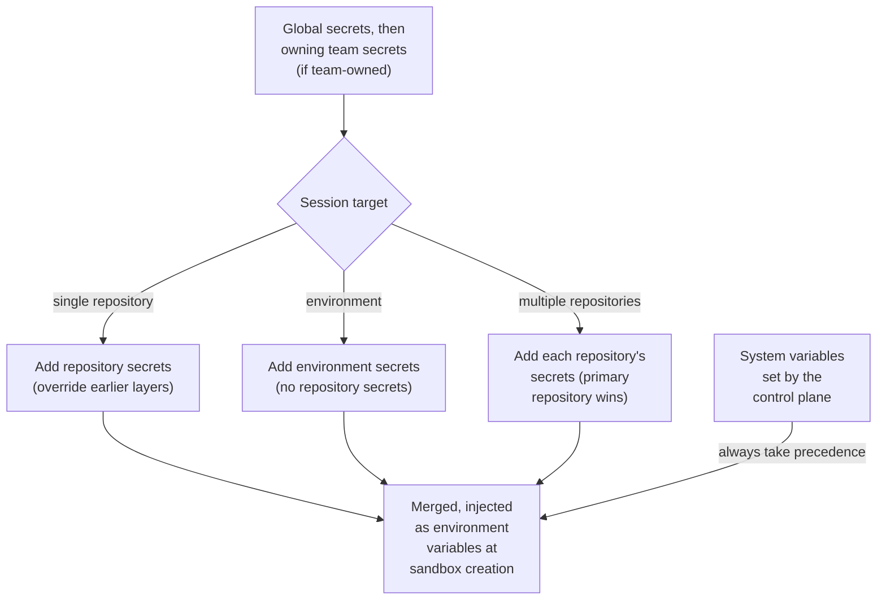

Secrets are environment variables (API keys, database URLs, service tokens) that OpenInspect injects into every sandbox launched from a scope, encrypted at rest and never shown again after you save them.


## Scopes

| Scope       | Applies to                                                                                 | Typical use                                                            |
| ----------- | ------------------------------------------------------------------------------------------ | ---------------------------------------------------------------------- |
| Global      | All sessions                                                                               | Keys every project needs, such as `ANTHROPIC_API_KEY`                  |
| Team        | Sessions owned by that team, regardless of session visibility                              | Credentials shared across a team's work                                |
| Repository  | Sessions launched from that repository, including sessions created by bots and automations | Project credentials such as `STRIPE_SECRET_KEY` or `AWS_ACCESS_KEY_ID` |
| Environment | Sessions launched from that environment                                                    | Credentials curated for a multi-repository environment                 |

Later scopes win: **global, then owning team, then repository or environment**. Workspace-owned sessions have no team layer; membership in a team does not inject its secrets into unrelated sessions. When you view a repository's secrets, inherited global keys appear in a read-only "Inherited from global scope" section with a Global badge, and a global entry that has been overridden shows which scope overrode it.

Global and repository secrets live under Settings › Secrets. Environment secrets live on the Secrets tab of each environment under Settings › Environments. Team secrets live on the team's **Secrets** tab. Team leads, workspace Administrators, and Owners can manage them; ordinary team membership alone does not allow listing secret keys or changing them. Team-secret management routes accept human users, not bots or sandbox credentials. See [Teams](/administration/teams).

## Which secrets a session receives

A session receives global secrets, its owning team's secrets if team-owned, and then the secrets of its session target, which is whatever you picked when you created the session. In this table, the team layer is omitted for workspace-owned sessions.

| Session target                                                          | Secrets injected                                                                                                               |
| ----------------------------------------------------------------------- | ------------------------------------------------------------------------------------------------------------------------------ |
| Single repository (web picker, Slack, GitHub, Linear)                   | Global + owning team + that repository's secrets                                                                               |
| Environment                                                             | Global + owning team + that environment's secrets. Member-repository secrets do not flow in.                                   |
| Ad-hoc multi-repository session ("Multiple repositories" in the picker) | Global + owning team + each selected repository's secrets. On a key collision the primary repository (first in the list) wins. |

Precedence, from the session target to the sandbox environment:



Environments are curated on purpose: a key added to a repository never silently lands in every environment that contains it. To reuse a repository secret in an environment, import it (below) or move it to global scope. The new-session picker states this when you select an environment or multiple repositories.

## Adding secrets

<Steps>
<Step>
### Open the scope

Go to Settings › Secrets. In the scope dropdown, pick "All Repositories (Global)" or a repository. For an environment, go to Settings › Environments, open the environment, and switch to its Secrets tab. For a team, open the team's Secrets tab. The editor works the same way in every scope.

</Step>
<Step>
### Add a row

Click Add secret, then enter a key and a value. Keys are automatically uppercased when saved, so `my_api_key` becomes `MY_API_KEY`.

</Step>
<Step>
### Save

Click Save secrets. The next sandbox launched from that scope has the secret available as an environment variable.

</Step>
</Steps>

### Paste a .env file

Paste a `.env`-formatted block (`KEY=value` lines) into any input field. OpenInspect parses it and populates one row per key. Reserved keys in the pasted block are skipped and reported.

### Update a secret

Existing values are masked (`••••••••`). To change a value, type the new value into the field and save. Leave the field empty to keep the current value.

### Delete a secret

Click Delete next to the row and confirm.

## Importing repository secrets into an environment

On an environment's Secrets tab, use "Import from a repository": pick a source repository that belongs to the environment, select the keys, and click Import. Values are copied server-side and never displayed.

Importing requires management access to the destination environment and `environments.secrets.manage`. The source repository is also checked: if teams have grants for it, a non-admin importer must lead an active granting team. A team-owned destination must have its own current grant for that repository. Belonging to the environment's repository list is not sufficient by itself.

<Callout type="warn" title="Imports are copies">
  If you later rotate the value on the repository, the environment keeps the old copy. Re-import the
  key or update the environment secret directly.
</Callout>

## Limits

| Constraint                 | Limit                                                         |
| -------------------------- | ------------------------------------------------------------- |
| Secrets per scope          | 50                                                            |
| Key length                 | 256 characters                                                |
| Value size                 | 16 KB                                                         |
| Total value size per scope | 64 KB                                                         |
| Combined size per session  | 128 KB (global + owning team + session target, after merging) |
| Key format                 | `[A-Za-z_][A-Za-z0-9_]*` (letters, digits, underscores)       |

If the merged payload for a session or an image build exceeds the combined cap, the spawn fails with an error that attributes bytes to each contributing scope so you know what to trim. This mostly matters for multi-repository sessions, where several repositories' secrets fold into one sandbox.

## Reserved keys

These keys are used by the system and cannot be saved as secrets. The editor shows a validation error if you try.

```text
PYTHONUNBUFFERED  SANDBOX_ID  CONTROL_PLANE_URL  SANDBOX_AUTH_TOKEN
REPO_OWNER  REPO_NAME  GITHUB_APP_TOKEN  SESSION_CONFIG
RESTORED_FROM_SNAPSHOT  OPENCODE_CONFIG_CONTENT
PATH  HOME  USER  SHELL  TERM  PWD  LANG
```

## Security

### GitHub App credentials

Fresh and restored sandboxes request scoped Git credentials from the control plane on demand. Keep the GitHub App private key in the control plane, not in global, team, repository, or environment secrets. The optional GitHub bot Worker still needs its own App credential bindings.

The legacy Modal `github-app` secret is optional and not required for sandbox Git credentials. Modal still requires `internal-api` (`MODAL_API_SECRET` and `ALLOWED_CONTROL_PLANE_HOSTS`) and the `llm-api-keys` secret object. A model key in that object may be empty when sessions use credentials from the control-plane secret store. Terraform provisions these required Modal secrets. See [Deployment](/administration/deployment#modal-secrets).

### Stored secret protection

- Values are encrypted with AES-256-GCM before they are stored.
- Values are never returned by the API after saving. Only key names are visible in the browser.
- Secrets are decrypted at sandbox creation time and injected as environment variables.
- System variables set by the control plane always take precedence over user-defined secrets with the same name.

Provider accounts are separate from secrets. OpenAI and xAI subscription credentials belong under Settings › Accounts, not in Secrets; their tokens stay in the control plane and are never injected into sandboxes. When a session runs in account mode, that provider's API key is removed from the sandbox environment so the runtime cannot bypass the selected subscription. API-key mode keeps using ordinary global, team, repository, or environment secrets. Team secrets are not a source for legacy provider OAuth brokers; use provider accounts for subscription authentication. See [provider accounts](/models/provider-accounts).

## Secrets and prebuilt images

Repository image builds receive global + repository secrets, **never team secrets**, because those images are shared across teams. Environment builds receive global + the environment's owning team (if any) + environment secrets, never member-repository secrets. A team session using a workspace-owned environment still receives its session team's secrets at runtime, but that workspace environment's image build does not.

Anything `.openinspect/setup.sh` writes to disk is captured in the image and can outlive a rotation. Read secrets from the environment at runtime instead. Changing or deleting team secrets invalidates images for environments owned by that team and schedules best-effort rebuilds where prebuilds are enabled. See [Secrets and images](/configure/prebuilt-images#secrets-and-images).

## Common examples

| Key                 | Scope      | Purpose                                                                                                     |
| ------------------- | ---------- | ----------------------------------------------------------------------------------------------------------- |
| `ANTHROPIC_API_KEY` | Global     | Claude models (unless the deployment configured a fleet-wide key; a global secret takes precedence over it) |
| `OPENAI_API_KEY`    | Global     | OpenAI models when a session selects API-key mode                                                           |
| `XAI_API_KEY`       | Global     | xAI models when a session selects API-key mode                                                              |
| `DEEPSEEK_API_KEY`  | Global     | DeepSeek models                                                                                             |
| `ZHIPU_API_KEY`     | Global     | Z.AI Coding Plan GLM models                                                                                 |
| `OPENCODE_API_KEY`  | Global     | OpenCode Zen and OpenCode Go models                                                                         |
| `DATABASE_URL`      | Repository | Database connection string                                                                                  |
| `AWS_ACCESS_KEY_ID` | Repository | AWS credentials for one project                                                                             |
| `STRIPE_SECRET_KEY` | Repository | Stripe key for one project                                                                                  |

## Troubleshooting

<Accordions>
  <Accordion title="Model not found">
    Cause: the session's provider authentication is missing. Fix: check the selected authentication
    mode first. In provider-account mode, verify the account and its model entitlement. In API-key
    mode, add the required key to the session's secret scope: `OPENAI_API_KEY` for OpenAI,
    `XAI_API_KEY` for xAI, `ANTHROPIC_API_KEY` for Claude, `DEEPSEEK_API_KEY` for DeepSeek,
    `ZHIPU_API_KEY` for Z.AI Coding Plan, and `OPENCODE_API_KEY` for OpenCode Zen and OpenCode Go
    (an `opencode-go/*` model also needs an active Go subscription on that key).

</Accordion>
  <Accordion title="Secret not appearing in the sandbox">
    Cause: wrong scope, a reserved key, or a sandbox that predates the change. Fix: confirm the
    secret is saved under the scope the session uses (global, its owning team, the specific repository, or the
    environment), check that the key is not reserved, and start a new session, since new secrets
    apply only to new sandboxes. For environment sessions, repository secrets do not flow in; add
    the key to the environment or import it on the environment's Secrets tab.

</Accordion>
  <Accordion title="Key name was changed">
    Cause: keys are uppercased on save. Fix: reference the uppercased name in your scripts, for
    example `MY_API_KEY` instead of `my_api_key`.

</Accordion>
  <Accordion title="Save rejected with a size or count error">
    Cause: the scope hit a limit (50 secrets, 16 KB per value, or 64 KB total). Fix: remove unused
    keys or shorten values. If a session spawn fails on the 128 KB combined cap, trim the scopes the
    error names.

</Accordion>
</Accordions>

## Next steps

- [Environments](/configure/environments)
- [Prebuilt images](/configure/prebuilt-images)
- [Provider accounts](/models/provider-accounts)
