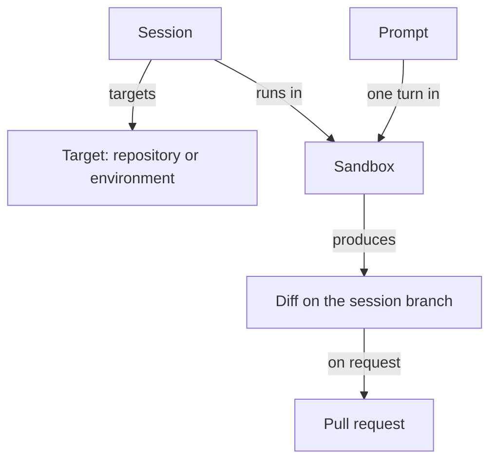

This page defines the terms you will meet everywhere else in these docs.

## Session

A session is the unit of work: one conversation with the agent about one target. It is a durable record that holds your prompts, the event timeline, artifacts, participants, and a reference to the current sandbox. It survives your browser closing and outlives any single sandbox. Ownership, visibility (Team, Workspace, or Private), collaborators, and workspace permissions determine access; reading does not automatically permit prompting. Prompting requires collaboration permission and session access, including current owning-team membership for team-owned sessions. A session can be archived and later restored by someone with lifecycle access.

Learn more: [Session page](/sessions/session-page), [Lifecycle and statuses](/sessions/lifecycle-and-statuses), [Multiplayer and sharing](/sessions/multiplayer-and-sharing).

## Sandbox

A sandbox is the isolated runtime where the agent actually works: a Linux environment with Node.js, Python, git, a headless browser, and the agent harness. The deployment's configured sandbox provider creates it. A sandbox boots fresh (clone, `setup.sh`, `start.sh`), from a prebuilt image (setup already done), or from a snapshot of a previous sandbox for the same session (dependencies and branch already in place). A session has many sandboxes over its life; the sandbox is disposable, the session is not.

Learn more: [Sandbox providers](/configure/sandbox-providers), [Sandbox environment](/reference/sandbox-environment).

## Target

The target is what the sandbox works on, chosen when the session is created: a single repository at a chosen branch, an ad-hoc set of up to 10 repositories, a saved environment, or no repository at all. In any multi-repository target the first repository is the primary; it decides which per-repository settings apply and wins secret key collisions. Each repository is cloned into its own directory under `/workspace`.

Learn more: [Quickstart](/getting-started/quickstart), [Environments](/configure/environments).

## Environment

An environment is a saved, named repository set with a base branch per repository, owned by the workspace or a team. Environment sessions receive global secrets, then the session's owning-team secrets when present, then environment secrets, never the member repositories' secrets. Environments can have prebuilt images so sessions boot faster. Sessions snapshot the environment at creation; editing or deleting the environment later does not change what an existing session works on.

Learn more: [Environments](/configure/environments), [Prebuilt images](/configure/prebuilt-images).

## Prompt and follow-up

A prompt is one message to the agent, optionally with images. While a prompt is running, further prompts are queued and run in order once the current one finishes. **Stop** ends the running prompt; queued prompts still run afterwards. A queued prompt can be removed from the queue before it starts. Cancelling a session is different: it ends the session, stops its sandbox, and the session accepts no more prompts.

Learn more: [Follow-ups and stopping](/sessions/follow-ups-and-stopping).

## Harness

The harness is the agent program that runs inside the sandbox. **OpenCode** is the default and runs every enabled model. **Claude Agent** runs Anthropic models only and can use a connected Claude account instead of an API key. Every session runs on exactly one harness, chosen at creation and fixed for its life; child sessions inherit it. Slack, GitHub, and Linear launches use the harness chosen in their integration settings (OpenCode by default; Slack users can pick their own in App Home), and automations let you choose OpenCode or Claude Agent.

Learn more: [Agent harnesses](/models/agent-harnesses).

## Model and provider account

The model is the language model behind the harness, chosen per session from the set enabled under Settings › Models, with a reasoning effort where the model supports one. A provider account is a connected subscription (OpenAI, xAI, or Anthropic) that a session can use instead of an API key. When both exist, the composer lets you follow the deployment default, pick an account, or use the API key.

Learn more: [Choosing a model](/models/choosing-a-model), [Provider accounts](/models/provider-accounts).

## Managed skill

A managed skill is a reusable instruction file, with optional supporting files, stored in the workspace and assigned to repositories, environments, or everything. At session creation you choose **All applicable**, **None**, or a personal profile; the matching skills are installed into the sandbox before the agent starts and pinned at their current revision for that session.

Learn more: [Managed skills](/configure/managed-skills).

## Automation

An automation starts a new session without a person typing a prompt. Its trigger is a cron schedule or an event: an inbound webhook, a GitHub event, a Slack message, or a Sentry alert. The automation carries the target, harness, model, and instructions for the sessions it creates. It has workspace or team ownership and a separate executor identity. Run history links to sessions only when you can read them.

Learn more: [Automations](/automations).

## Integration

Integrations connect OpenInspect to the tools where work already happens. Slack starts sessions from mentions and messages and posts results back. GitHub reviews pull requests, answers @mentions, and can feed pull request feedback back into the session that opened it. Linear starts sessions from issue activity. Sessions created this way are the same sessions you see on the web.

Learn more: [Integrations](/integrations).

## Artifact

An artifact is an output the session recorded: a pull request, a screenshot, a video, a preview, or a pushed branch. Pull request artifacts track their state (draft, open, merged, closed) and appear in the sidebar; screenshots and videos appear under **Media**.

Learn more: [Reviewing changes](/sessions/reviewing-changes).

## Participant and attribution

A participant is anyone who has joined a session. Every prompt is tagged with its author. Commits use that person's source-control identity when available; otherwise they use the configured git user, or the signing account if commit signing is enabled. With signing enabled, the signing account is the committer. A GitHub pull request is created as the prompting user when their OAuth token is resolved, or as the App when no token is returned. Participation records who contributed; it does not grant or remove access.

Learn more: [Multiplayer and sharing](/sessions/multiplayer-and-sharing).

## Workspace and roles

A deployment is one workspace. On a GitHub-backed deployment, the GitHub App installation defines its maximum repository reach. Every admitted user has one workspace role; the built-in roles are **Owner**, **Administrator**, **Member**, and **Viewer**. Members create and prompt eligible sessions and manage automations as executor or owning-team lead. Administrators also manage shared configuration and members. Owners additionally control who holds the Owner role. Viewers have read-only workspace feature permissions. New users start as Members. Resource-specific access rules apply in addition to these permissions.

Learn more: [Workspace access](/administration/workspace-access).

## Team

A team groups members and leads, owns sessions, environments, and automations, and holds repository grants and secrets. Ownership is fixed at creation and is separate from session visibility: making a team session Workspace-visible does not let non-members act on it. Team visibility's read boundary depends on deployment enforcement; the default `shadow` mode does not enforce non-private team-session read isolation. Private access and team-owned actions remain enforced in every mode.

Learn more: [Teams](/administration/teams), [Teams enforcement](/administration/deployment#teams-enforcement).

## How the concepts fit together

A session owns a target and a series of prompts. Each prompt runs as a turn inside the session's current sandbox, and the result is a diff on the session branch and, when you ask for one, a pull request.

## Session status vs sandbox status

The two are independent. Session status is the durable state of the conversation; sandbox status is the state of the current sandbox. A session can be `completed` with a live sandbox still attached, or `active` with no sandbox at all.

| Level   | Values                                                                                                | Accepts new prompts                                                       |
| ------- | ----------------------------------------------------------------------------------------------------- | ------------------------------------------------------------------------- |
| Session | `created`, `active`, `completed`, `failed`, `archived`, `cancelled`                                   | `created`, `active`, `completed`, `failed`; not `archived` or `cancelled` |
| Sandbox | `pending`, `spawning`, `connecting`, `warming`, `ready`, `stale`, `snapshotting`, `stopped`, `failed` | A prompt waits for `ready`; a stopped or failed sandbox is replaced       |

Each prompt also has its own status: `pending`, `processing`, `completed`, or `failed`.

Learn more: [Statuses reference](/reference/statuses).

## Next steps

- [Quickstart](/getting-started/quickstart)
- [When to delegate](/prompting/when-to-delegate)
- [Glossary](/reference/glossary)
