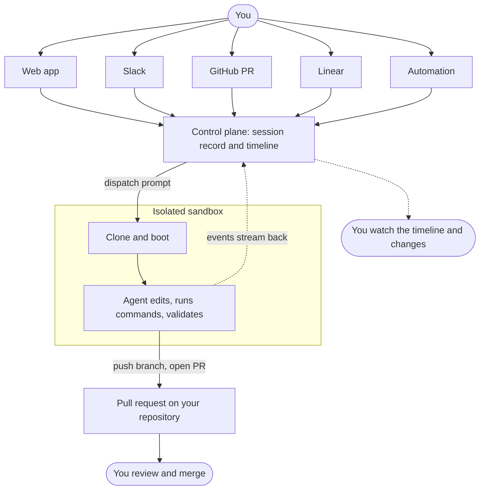

OpenInspect is a background coding agent. You describe a piece of work, the agent runs it in an isolated cloud sandbox with a full development environment, and you come back to review the result: a response, a diff, and usually a pull request.

The agent does not need you to stay connected. Send a prompt from the web app, Slack, a GitHub pull request, a Linear issue, or an automation, close the tab, and check the session later. Several people can watch and prompt the same session at the same time. Prompts record who sent them; commits use that person's source-control identity when available, or the configured Git user (the signing account when signing is enabled) otherwise.

## Start here

<Cards>
  <Card
    title="Quickstart"
    href="/getting-started/quickstart"
    description="Sign in, start a session against a repository, and read the first result."
  />
  <Card
    title="Your first pull request"
    href="/getting-started/first-pull-request"
    description="Ask the agent for a pull request, see how it is created, and review it like any other."
  />
  <Card
    title="Writing prompts that work"
    href="/prompting/writing-prompts"
    description="Give the agent a bounded task, the context it needs, and a definition of done."
  />
  <Card
    title="Automations"
    href="/automations"
    description="Start sessions on a schedule or when a webhook, GitHub, Slack, or Sentry event arrives."
  />
</Cards>

## One lifecycle

Every session, whether it starts from the web composer, a Slack message, or an automation, follows the same path.

From your side, each session comes down to four actions:

1. **Choose** a target: a single repository and branch, an ad-hoc set of up to 10 repositories, a saved environment, or no repository at all.
2. **Describe** the work in one prompt: the goal, the constraints, and how the agent should prove it is done. Images can be attached.
3. **Review** the timeline, the final response, and **Changes** (the diff compared with session start), plus the tests or screenshots the agent produced.
4. **Iterate**: send another prompt on the same branch, ask for a pull request, or open the sandbox terminal and code server and finish the work yourself.

## Capability map

| Area           | What it covers                                                                                                                 | Start with                                           |
| -------------- | ------------------------------------------------------------------------------------------------------------------------------ | ---------------------------------------------------- |
| Sessions       | The session page, follow-ups and stopping, reviewing diffs, sandbox tools, sharing, child sessions, statuses, and recovery.    | [Session page](/sessions/session-page)               |
| Prompting      | When to delegate, how to write a prompt the agent can finish, templates, and workflow recipes.                                 | [When to delegate](/prompting/when-to-delegate)      |
| Configuration  | Lifecycle scripts, environments, prebuilt images, secrets, sandbox settings, source control, skills, MCP servers.              | [Lifecycle scripts](/configure/lifecycle-scripts)    |
| Models         | Choosing a model and reasoning effort, the two agent harnesses, and provider accounts.                                         | [Choosing a model](/models/choosing-a-model)         |
| Automations    | Sessions started by a schedule, an inbound webhook, a GitHub event, a Slack message, or a Sentry alert.                        | [Automations](/automations)                          |
| Integrations   | Slack, GitHub (reviews, mentions, PR Feedback Autofix), and Linear.                                                            | [Integrations](/integrations)                        |
| Administration | Workspace access and roles, [Teams](/administration/teams), the audit log, analytics, data controls, security, and deployment. | [Workspace access](/administration/workspace-access) |

## Where people stay in control

The built-in pull-request tool opens PRs but does not merge them. The agent can also run the GitHub CLI, including merge commands, when its credentials and repository rules permit it. GitHub PRs are authored as the prompting user when a token can be resolved, or as the App otherwise. Enforce branch protection, required reviews, and status checks in your repository.

Sessions have Workspace, Team, or Private visibility, separate from their fixed ownership. Team-owned actions require current team membership even for administrators, except for reads and collaborator self-removal; private sessions support explicit collaborators and audited Owner break-glass reads. Non-private Team read isolation requires enforcement to be `on`, rather than the default `shadow`; see [Deployment](/administration/deployment). Every prompt is attributed to its author, and administrators can read the audit log to see who did what. See [Multiplayer and sharing](/sessions/multiplayer-and-sharing) for the access rules.
